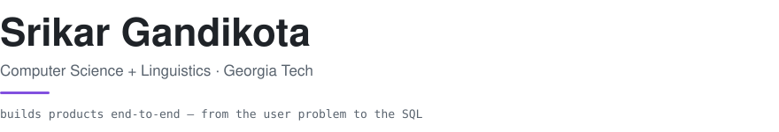

<picture>
  <source media="(prefers-color-scheme: dark)" srcset="header-dark.svg">
  
</picture>

Most of what's here started as a specific, personal annoyance I decided to build my way out of. Each repo's README covers the design decisions; this page covers where the ideas came from.

### [music-tagger](https://github.com/srikargandikota/music-tagger) · React Native, Node/TypeScript, Postgres

A full-stack Spotify companion app. The idea came from watching my own playlists rot: I'd build "study vibes" in September and abandon it by November, because a playlist freezes a mood in time. The way I actually think about music is in tags — chill, hype, late-night — and those don't expire. So the app lets you tag your library once, then ask for music in something close to plain language: `play chill study` builds a fresh queue of tracks tagged both chill *and* study; `queue any hype workout` relaxes it to either. The problem I enjoyed most was designing the small command grammar and compiling it down to a single parameterized SQL query.

### [melody-pathfinder](https://github.com/srikargandikota/melody-pathfinder) · Python, Q-learning

A reinforcement-learning agent that composes melodies. I minor in linguistics and grew up around music theory, and both fields share a premise: things that feel like taste often turn out to have rules. This project tests that on melody — stepwise motion sounds smooth, phrases want to resolve home — by writing those rules as a reward function and letting an agent search for melodies that satisfy them. The lesson came fast: naive rewards produce technically-perfect, boring melodies, and getting something listenable meant iterating on the reward the way you'd iterate on a product metric. It exports the best result as a playable MIDI file.

### [studymate-notes-ai](https://github.com/srikargandikota/studymate-notes-ai) · Python, classical NLP

A study tool that turns raw lecture notes into a summary, ranked keywords, and a concept map. Built during exam season, out of distrust as much as need: I didn't want a summarizer that could hallucinate a fact into my notes the night before a test. So there's deliberately no LLM in it — extractive summarization via TF-IDF and PageRank, co-occurrence graphs for the concept map, a trie for prefix search. Every sentence in the output is one I actually wrote, and every choice the tool makes is traceable.

## Elsewhere

The through-line is products at the intersection of AI and language, and the path from user problem to shipped thing. Lately that has looked like: a zero-to-one program shipping customer-support AI agents as an AI/ML TPM intern at Qualpa, student research with BCG on how corporates partner with startups, and linguistics research on reducing dialect bias in speech-to-text across 300+ speakers.

Tools I reach for: Python, TypeScript, SQL, React Native, Node, PyTorch, scikit-learn, Figma.
